# ICHIGO (Team JENGA)

> _子供とコミュニケーションできる AI おしゃべり人形「ICHIGO」を操作するモバイルアプリ_ 担当：ハ・イェジン

  

# 主なる機能

## ハードウェアとの連動

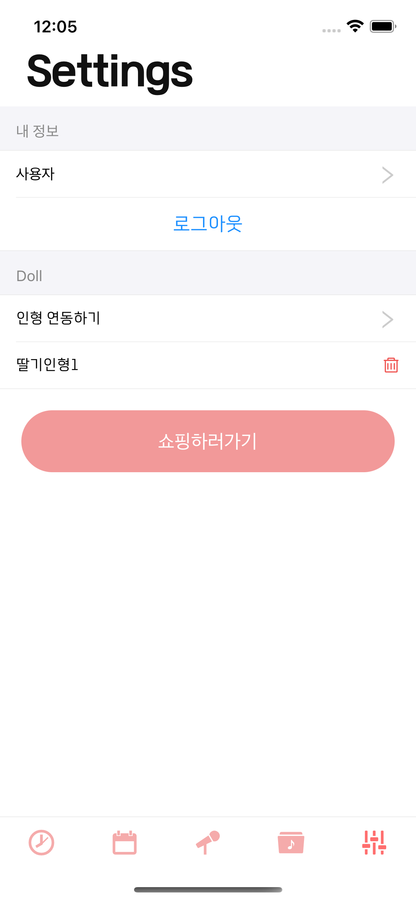</img>
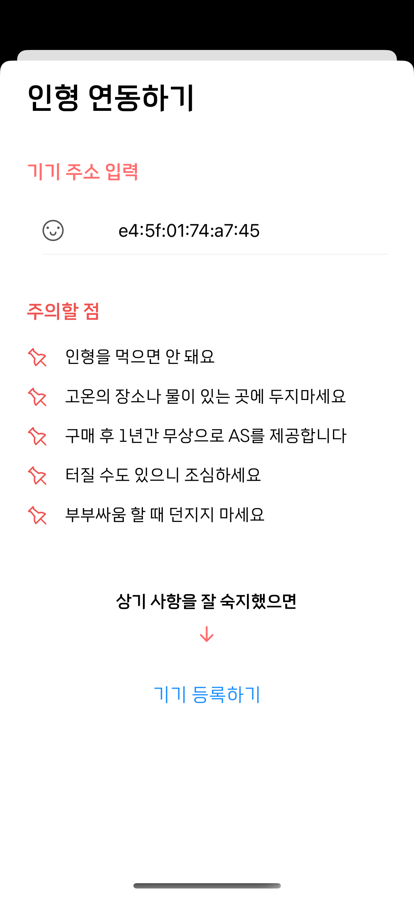</img>

- 購入した人形と一緒に送られた人形(ハードウェア)の MACAddress を App で入力することで Application と Hardware を連動する。

## Calendar

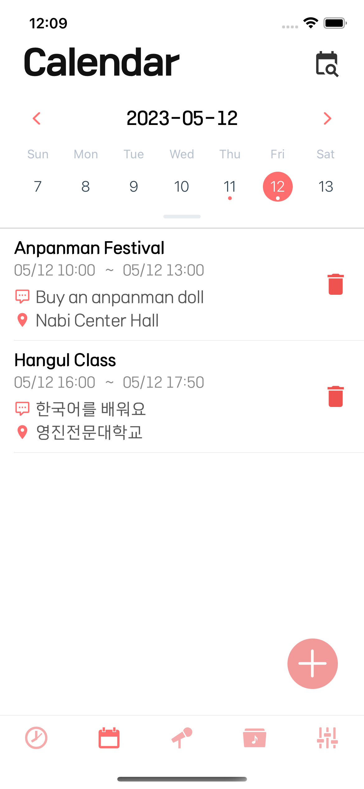</img>
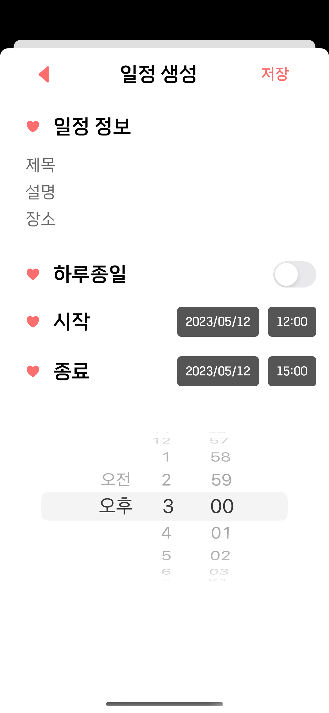</img>

- 子供の日程を管理するため、Web や Application を通じてスケージュールを追加し、Hardware（人形の本体）にデータを送る。
- スケジュール決められた時に人形を通じてお知らせする。

## Alarm

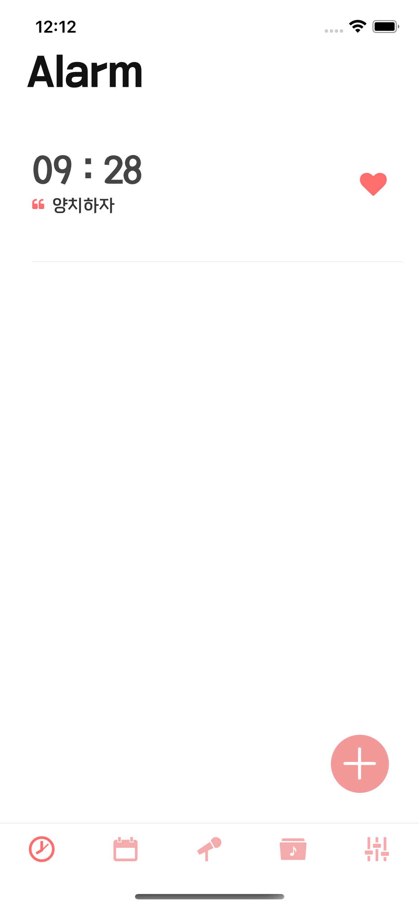</img>
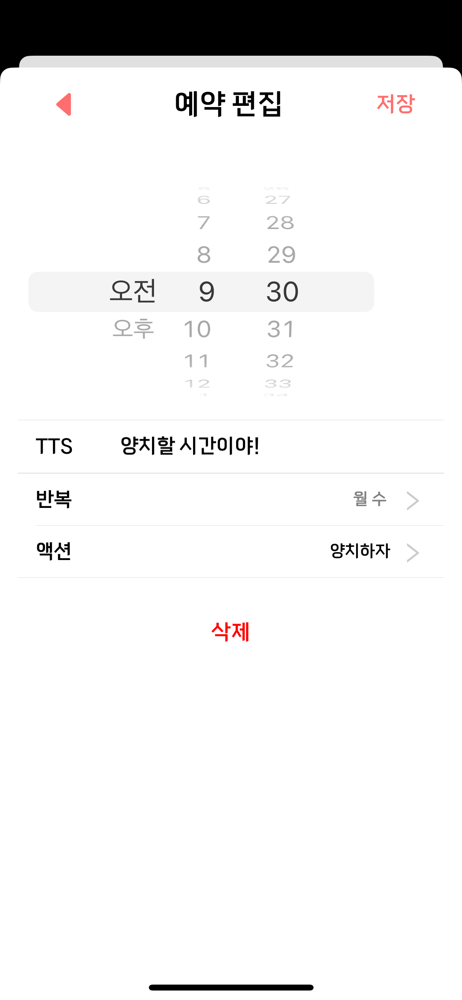</img>
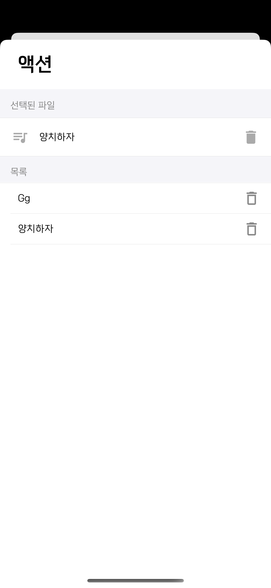</img>

- 子供にいい習慣を身に付けさせるため、アラームを登録し、Hardware(人形の「本体)にデータを送る。
  - 「リスニング」でアップロードしたオディオや文章も登録できる。
  - 🐻 文章を入力した場合、人形が音声読み上げしてあげる(TTS)。
- 決められた時間と曜日にお知らせする。

## 録音

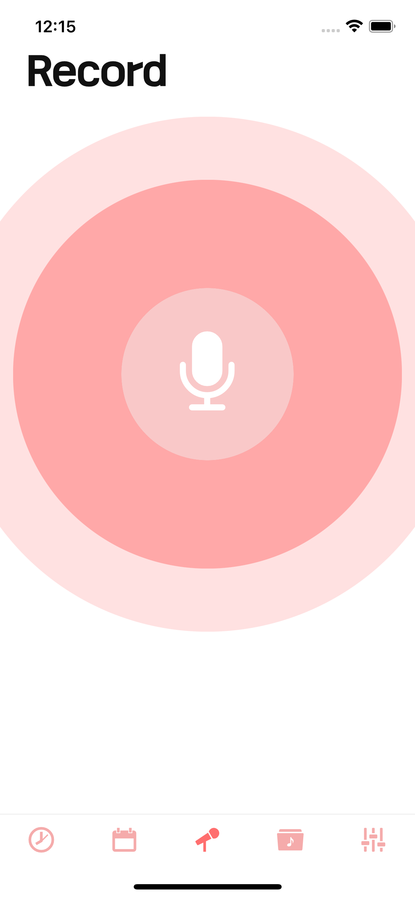</img>
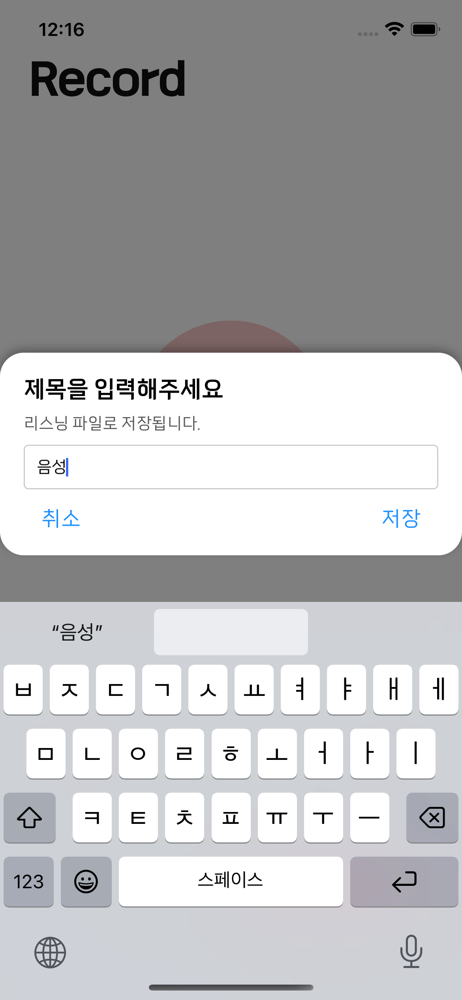</img>

- アラームに使われる音声を録音する
- 録音したオーディオファイルは確認のうえ、保存または削除することができる。
- 録音したファイルは「リスニング」で確認できる。

## リスニング

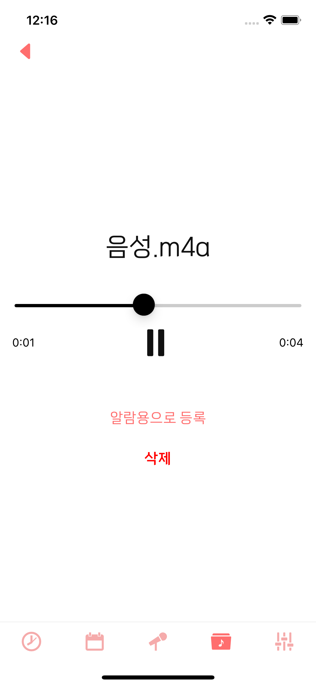</img>
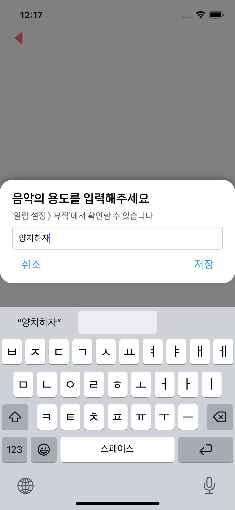</img>

- オーディオファイルを管理する
  - 「録音」で保存した音声
  - スマホにダウンロードしたオーディオファイル(アップロードの上で使用)
- 録音したオーディオファイルは、確認のうえ、保存または削除することができる。
- Alarm で使われるファイルを選択し、サーバーにアップロード

   

# ETC

- Login
  - Web と同じアカウントでログインする
- Sign Up
  - 新しいアカウントを作る
  - Web でも使うことができる
- Webview コンポーネントを通じてモバイルアプリでも Web の機能を使える。
  - ショッピングモール 
    人形の購入、人形のカスタム作り、カレンダー登録などの機能をモバイルアプリでも使える。

 

---
